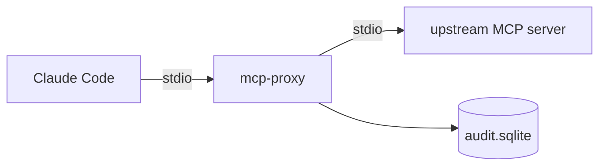

# SensitiveDataMCP

A proxy that sits between an MCP host (like Claude Code) and any MCP server. It **redacts
sensitive data from tool results before the model sees them** and **logs every tool call**, so
"what did the model pull?" is one query. Neither the host nor the upstream server needs to change.



## Example

```text
raw:      Gregory Moore called from (878)374-4126 to renew passport 575977079.
          Confirmation emailed to janetclay@example.net. SSN on file 242-47-3361.

redacted: [PERSON_1] called from [PHONE_1] to renew passport [PASSPORT_1].
          Confirmation emailed to [EMAIL_2]. SSN on file [SSN_2].
```

Placeholders are stable within a session, so the model can still tell two mentions are the same
person. Values found in structured fields (the name, phone, passport) are also caught inside
free text. Anything that can't be redacted safely is blocked, never passed through raw.

## Quick start

Requires Python 3.12+ and [uv](https://docs.astral.sh/uv/).

```bash
uv sync
cp config.example.yaml config.yaml    # points at the bundled fake upstream server
uv run pytest

claude mcp add sensitive-proxy -- uv run --directory "$PWD" mcp-proxy --config "$PWD/config.yaml"
uv run mcp-audit calls --full         # after a Claude Code session
```

If you see `No module named 'mcp_proxy'` on macOS, run `chflags -R nohidden .venv` (the
filesystem "hidden" flag makes Python skip the editable install).

## Configuration

See `config.example.yaml`. It has three parts: the `upstream` server command, the audit `log`
database path, and a **required** `redaction` section (`fields` map JSON keys to labels,
`patterns` map labels to regexes). Use `redaction: {enabled: false}` to log without redacting.

## Limitations

This reduces exposure and adds an audit trail. **It is not a compliance control** (HIPAA or
otherwise); don't point it at real sensitive data without further review.

- Names or bare digit numbers that never appear in a sensitive field aren't detected.
- Unicode lookalike and zero-width characters can evade the regexes.
- Image, audio, and resource results are blocked. Only tools are proxied, and tool descriptions
  and `_meta` pass through unredacted.
- The audit database is an unencrypted SQLite file. One proxy process is one session.

## Roadmap

Redis result caching (default-deny allowlist, redacted results only), richer session tracking,
and an optional Presidio-backed redactor.

## Development

`src/mcp_proxy/` holds the proxy; `fake_passport/` is a test server returning **synthetic**
records (Faker), so no real data is used anywhere. Tests: `uv run pytest`.

MIT licensed.
